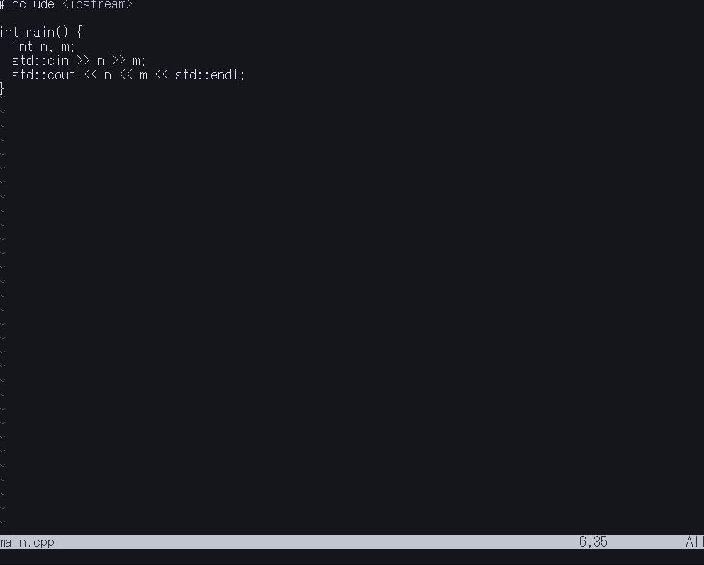

[](https://github.com/mdonaka/color-manager.nvim/blob/main/LICENSE)
[](https://neovim.io/)

[English README is here](./README.md)

# color-manager.nvim
color_manager.nvimはVimのColor Schemaを管理するPluginです．
Color Schemaの選択，インストール，アンインストールを簡単に行うことができます．



## インストール

### lazy.nvim

```lua
{
  "mdonaka/color-manager.nvim",
  dependencies = {
    "rafi/awesome-vim-colorschemes",
    {
      "ibhagwan/fzf-lua",
      dependencies = {
        "nvim-tree/nvim-web-devicons",
      },
    }
  },
}
```

### vim-plug

```vim
Plug 'mdonaka/color-manager.nvim'
Plug 'rafi/awesome-vim-colorschemes'
Plug 'ibhagwan/fzf-lua'
Plug 'nvim-tree/nvim-web-devicons'
```


## コマンド一覧

| コマンド                   | 説明                                                      |
|--------------------------|----------------------------------------------------------|
| `:ColorManager`           | Color Schema選択UIを開き，Schameを切り替えます          |
| `:ColorManagerInstall`    | Color Schema選択UIを開き，Schameをインストールします |
| `:ColorManagerUninstall`  | Color Schema選択UIを開き，Schameをアンインストールします |

## 設定
| オプション                        | 型        | デフォルト                                    | 説明                                    |
|----------------------------------|----------|-----------------------------------------------|----------------------------------------|
| `colors_dir`                     | `string` | `vim.fn.stdpath("config") .. "/colors/"`      | カラースキームを格納するディレクトリ          |
| `randomize_colorscheme_on_startup`| `boolean`| `false`                                       | 起動時にランダムでカラースキームを適用       |

### lazy.nvim
```lua
{
  "mdonaka/color-manager.nvim",
  dependencies = { ... },
  opts = {
    colors_dir = {string},
    randomize_colorscheme_on_startup = {boolean},
  }
}
```
### vim-plug
```vim
lua << EOF
require("color_manager").setup({
  colors_dir = {string},
  randomize_colorscheme_on_startup = {boolean},
})
EOF
```

## ライセンス

MIT
