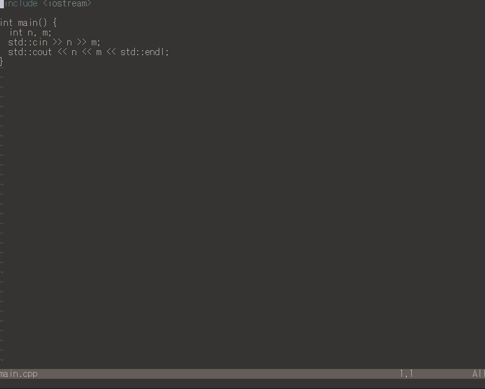

[](https://github.com/mdonaka/color-manager.nvim/blob/main/LICENSE)
[](https://neovim.io/)

[日本語READMEはこちら](./README-ja.md)

# color-manager.nvim
color-manager.nvim is a plugin for managing Color Schemes in Vim. 
It allows you to easily select, install, and uninstall color schemes.



## Installation

### lazy.nvim

```lua
{
  "mdonaka/color-manager.nvim",
  dependencies = {
    "rafi/awesome-vim-colorschemes",
    {
      "ibhagwan/fzf-lua",
      dependencies = {
        "nvim-tree/nvim-web-devicons",
      },
    }
  },
}
```

### vim-plug

```vim
Plug 'mdonaka/color-manager.nvim'
```

## Commands

| Command                    | Description                                                            |
|----------------------------|------------------------------------------------------------------------|
| `:ColorManager`           | Opens the color scheme selection UI and switches a scheme            |
| `:ColorManagerInstall`    | Opens the color scheme selection UI and installs a color scheme          |
| `:ColorManagerUninstall`  | Opens the color scheme selection UI and uninstalls a color scheme        |

## Configuration

| Option                          | Type      | Default                                      | Description                                   |
|----------------------------------|-----------|----------------------------------------------|-----------------------------------------------|
| `colors_dir`                     | `string`  | `vim.fn.stdpath("config") .. "/colors/"`     | Directory to store color schemes              |
| `randomize_colorscheme_on_startup`| `boolean` | `false`                                      | Apply a random color scheme on startup        |

### lazy.nvim
```lua
{
  "mdonaka/color-manager.nvim",
  opts = {
    colors_dir = {string},
    randomize_colorscheme_on_startup = {boolean},
  }
  -- other options...
}
```
### vim-plug
```vim
Plug 'mdonaka/color-manager.nvim'
lua << EOF
require("color_manager").setup({
  colors_dir = {string},
  randomize_colorscheme_on_startup = {boolean},
})
EOF
```

## License

MIT
